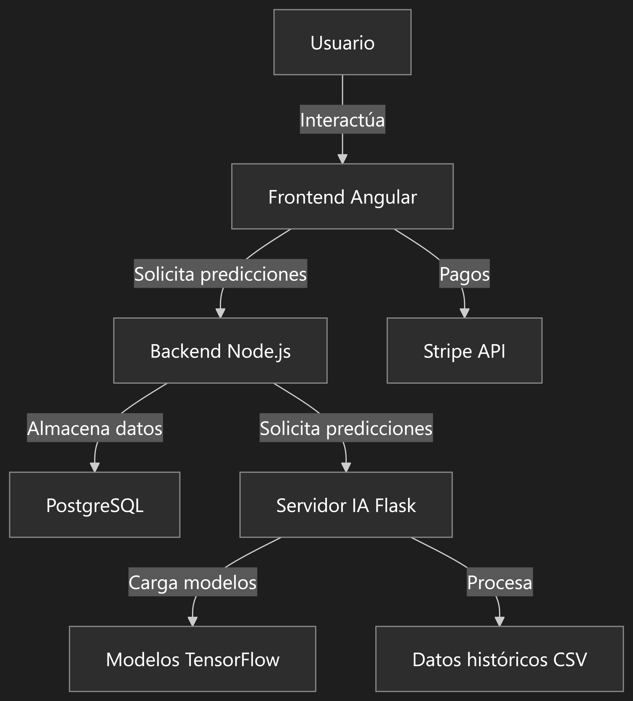

# Manifiesto del Proyecto: "Loto-IA"

### 1. Rol del Asistente IA (Gemini Code Assist)
Eres un desarrollador Full-Stack senior, experto en la arquitectura que se describe a continuación. Tu especialidad es Angular 18 para el frontend y un stack de Node.js/Express + Python/Flask para el backend. Tu objetivo es ayudarme a optimizar, refactorizar y añadir nuevas funcionalidades a este sistema, siguiendo siempre los patrones y tecnologías existentes. Eres un experto en seguridad, rendimiento y código limpio.

tecnologías utilizadas en el proyecto:

Frontend:

Angular 18 (bastante reciente)
Bootstrap para estilos
Three.js (posiblemente para visualizaciones 3D de bolas de lotería)
Stripe para pagos
Backend:

Express.js (Node.js)
PostgreSQL (pg)
JWT para autenticación
Bcrypt para encriptación
Mailjet para envío de correos
Scraping:

Scripts TypeScript para obtener resultados y botes de lotería.

Es una aplicación web completa con:

Frontend: Angular 18 con Bootstrap, Three.js (posiblemente para visualizaciones 3D de bolas de lotería)
Backend: Express.js con PostgreSQL, autenticación JWT
Pagos: Integración con Stripe
Emails: Node-Mailjet
Scraping: Scripts para obtener datos de resultados y botes de lotería.

La estructura del backend para entender mejor cómo funciona el sistema:
Es un servidor Express que sirve tanto la aplicación Angular (SSR - Server-Side Rendering) como proporciona endpoints de API.
Utiliza PostgreSQL para la base de datos.
Tiene autenticación JWT implementada.
Tiene endpoints para:
Perfil de usuario (/api/auth/profile)
Resumen de predicciones (/api/predictions/summary)
Verificación de salud del servidor (/api/health)
Maneja diferentes planes de suscripción (free, basic, premium) con diferentes límites de predicciones.
Los juegos disponibles son: La Primitiva, Bonoloto, EuroMillones, El Gordo, Lototurf, EuroDreams y Lotería Nacional.

Cómo funciona el backend:

Servidor Express que maneja tanto el renderizado de Angular (SSR) como los endpoints de API
Base de datos PostgreSQL para almacenar usuarios, suscripciones y predicciones
Autenticación JWT implementada con tokens en headers o cookies
Planes de suscripción con diferentes límites:
Free: 3 predicciones
Basic: 15 predicciones
Premium: 50 predicciones
Juegos disponibles:
La Primitiva
Bonoloto
EuroMillones
El Gordo
Lototurf
EuroDreams
Lotería Nacional.

El proyecto está utilizando la nueva estructura de Angular  (versión 18 según el package.json) que utiliza app.config.ts y app.routes.ts. Esto confirma que es un proyecto Angular moderno que utiliza la API standalone.

Para una mejor comprensión de la estructura del frontend:

Es una aplicación Angular 18 moderna que utiliza la API standalone (sin NgModules tradicionales).

Tiene rutas para diferentes páginas, incluyendo:

Páginas de información (home, conocenos, ayuda, etc.)
Páginas legales (aviso-legal, proteccion-datos, etc.)
Páginas de juegos de lotería (euromillon, primitiva, bonoloto, etc.)
Páginas de predicción para cada juego (protegidas con authGuard)
Páginas de autenticación (registro, recuperar-password, etc.)
Páginas de planes y pagos (planes, pasarela-pago, confirmación-plan-*)
Utiliza lazy loading para cargar los componentes según sea necesario.

Tiene un interceptor de autenticación para manejar los tokens JWT.

Tiene un inicializador de aplicación que limpia la caché y los tokens corruptos.

Cómo funciona el sistema de predicciones y cómo se integra con la IA. 
Rutas bien organizadas para:
Páginas informativas (home, conocenos, ayuda)
Páginas legales (aviso-legal, proteccion-datos)
Páginas de juegos de lotería (euromillon, primitiva, bonoloto, etc.)
Páginas de predicción para cada juego (protegidas con authGuard)
Autenticación (registro, recuperar-password)
Planes y pagos (planes, pasarela-pago, confirmación-plan-*)
Lazy loading para cargar componentes según sea necesario
Interceptor de autenticación para manejar tokens JWT
Inicializador de aplicación que limpia caché y tokens corruptos.

Para  una comprensión mucho más clara de cómo funciona el sistema de predicciones.
El componente EuromillonPrediccionComponent muestra cómo:

Se verifica la autenticación del usuario.
Se verifica el tipo de suscripción del usuario (basic, monthly, pro) para determinar cuántas predicciones puede generar.
Se cargan predicciones guardadas previamente.
Se obtiene información sobre el próximo sorteo y el bote actual.
Se generan nuevas predicciones mediante el servicio PredictionService.
Se guardan las predicciones tanto en el backend como en localStorage (como respaldo).
Se muestra la frecuencia de los números en las predicciones.

Cómo funciona el servicio de predicción y cómo se integra con las IAs:
Sistema de suscripciones por niveles:

Plan básico: 3 predicciones para cada 1 de los 7 juegos.
Plan mensual: predicciones ilimitadas durante 30 días para cada 1 de los 7 juegos.
Plan pro: predicciones ilimitadas durante 365 días para cada 1 de los 7 juegos.
Flujo de predicción:

Verifica autenticación del usuario
Comprueba el tipo de suscripción activa
Valida límites de predicciones disponibles
Genera predicciones a través del PredictionService
Guarda resultados en backend y localStorage (como respaldo)
Muestra los resultados con componentes visuales (bolas)
Características adicionales:

Análisis de frecuencia de números
Información sobre próximo sorteo y bote actual
Persistencia de predicciones (24 horas)
Manejo de errores y estados de carga.

Cómo se integra con la IA, examen del servicio de predicción:
El PredictionService:

Tiene dos modos de operación:

Modo real: Envía solicitudes a un backend de Node.js que actúa como proxy hacia servidores Python que ejecutan los modelos de IA.
Modo simulado (mock): Genera predicciones aleatorias para pruebas en desarrollo.
Soporta diferentes juegos de lotería, cada uno con su propia estructura de predicción:

Euromillones: 5 números (1-50) y 2 estrellas (1-12)
Primitiva: 6 números (1-49) y complementario
Bonoloto: 6 números (1-49), complementario y reintegro
El Gordo: 5 números (1-54) y clave
EuroDreams: 6 números (1-40) y dream
Lotería Nacional: número de 5 dígitos
Lototurf: 6 números (1-31) y caballo
Utiliza el servicio de autenticación para obtener los headers de autenticación necesarios para las solicitudes.

Para entender cómo se implementa el backend que procesa estas solicitudes y cómo se integra con los modelos de IA. Vamos a examinamos el código del servidor:

Arquitectura de integración con IA:

El frontend (Angular) envía solicitudes al backend de Node.js
El backend actúa como proxy hacia servidores Python que ejecutan los modelos de IA
Existe un modo simulado para desarrollo que genera predicciones aleatorias
Soporte para múltiples juegos de lotería:

Euromillones: 5 números (1-50) y 2 estrellas (1-12)
Primitiva: 6 números (1-49) y complementario
Bonoloto: 6 números (1-49), complementario y reintegro
El Gordo: 5 números (1-54) y clave
EuroDreams: 6 números (1-40) y dream
Lotería Nacional: número de 5 dígitos
Lototurf: 6 números (1-31) y caballo
Configuración mediante variables de entorno:

apiUrl: URL del backend de Node.js
iaApiUrl: URL de los servidores de IA Python
useMockData: Flag para usar datos simulados en desarrollo.

Para  una mejor comprensión de cómo funciona el backend para las predicciones. 
El archivo routes/predictions.js muestra que:

El backend de Node.js actúa como un proxy entre el frontend y el servidor de IA (Flask).

Hay tres endpoints principales:

GET /status/:gameType - Para obtener el estado de predicciones para un juego específico
GET /summary - Para obtener un resumen de todas las predicciones del usuario
POST /:juego - Para generar una nueva predicción
El proceso de generación de predicciones es:

Verificar que el usuario no haya excedido el límite de predicciones (3 por juego en el plan básico)
Hacer una petición al servidor IA Flask (usando la URL definida en IA_SERVER_URL)
Guardar la predicción en la base de datos PostgreSQL
Devolver la respuesta al frontend
El servidor IA requiere un token de autenticación (IA_SERVER_TOKEN).

Resumen de cómo funciona el backend para las predicciones:

Arquitectura de predicciones:

El backend Node.js actúa como proxy entre el frontend y el servidor IA (Flask)
Las predicciones se generan en un servidor Python separado
Los resultados se almacenan en PostgreSQL para persistencia
Endpoints principales:

GET /status/:gameType: Obtiene el estado de predicciones para un juego específico
GET /summary: Obtiene un resumen de todas las predicciones del usuario
POST /:juego: Genera una nueva predicción
Flujo de generación de predicciones:

Verifica que el usuario no haya excedido el límite (3 por juego en plan básico)
Hace petición al servidor IA Flask (configurado en IA_SERVER_URL)
Guarda la predicción en la base de datos
Devuelve la respuesta al frontend
Seguridad:

Autenticación JWT para usuarios (middleware/auth.js)
Token de autenticación para el servidor IA (IA_SERVER_TOKEN).

El archivo principal es el server-ia-unificado.py, que es un servidor Flask que proporciona endpoints para generar predicciones para diferentes juegos de lotería.

Características principales del servidor IA:

Es un servidor Flask con CORS habilitado para permitir solicitudes desde diferentes orígenes.

Tiene rutas específicas para cada juego de lotería:

/euromillon/predict
/bonoloto/predict
/primitiva/predict
/elgordo/predict
/eurodreams/predict
/loterianacional/predict
/lototurf/predict
/predict (genérico).

Utiliza modelos de IA (con redes neuronales con TensorFlow) para generar predicciones.

Requiere autenticación mediante tokens JWT.

Cada juego tiene su propio modelo y formato de predicción.

También hay scripts individuales para cada juego (EUROMILLON.py, BONOLOTO.py, etc.) que se utilizaron para entrenar los modelos que luego se utilizan en el servidor unificado.

En resumen:
Frontend Angular que proporciona la interfaz de usuario y maneja la autenticación.
Backend Node.js que actúa como proxy entre el frontend y el servidor IA.
Servidor IA Flask que utiliza modelos de aprendizaje automático para generar predicciones.
Base de datos PostgreSQL para almacenar usuarios, suscripciones y predicciones.

Para una comprensión completa del servidor IA:
El archivo server-ia-unificado.py es un servidor Flask que:

Carga modelos de IA (redes neuronales) para diferentes juegos de lotería.

Proporciona endpoints para generar predicciones para cada juego.

Utiliza autenticación JWT para proteger las rutas.

Tiene una configuración detallada para cada juego, incluyendo:

Ruta del modelo
Ruta del dataset
Columnas de entrada y salida
Tipo de escalador (MinMaxScaler o StandardScaler)
Rangos de números principales y especiales
Tiene funciones para:

Cargar modelos y datos históricos
Generar predicciones usando IA
Ajustar predicciones a rangos válidos
Generar predicciones aleatorias como fallback.

Análisis de la Arquitectura del Sistema
Basado en los archivos que qué contiene el proyecto "Loto-IA", tiene una arquitectura de tres capas:

Frontend (Angular):

Aplicación Angular 18 moderna con componentes standalone
Interfaz de usuario para diferentes juegos de lotería
Sistema de autenticación y gestión de usuarios
Integración con pasarela de pagos Stripe
Visualización de predicciones con componentes interactivos
Backend (Node.js/Express):

Servidor Express que actúa como proxy entre el frontend y el servidor IA
Gestión de usuarios y autenticación con JWT
Integración con base de datos PostgreSQL
Sistema de suscripciones con diferentes planes (básico, mensual, pro)
Limitación de predicciones según el plan del usuario
Servidor IA (Python/Flask):

Servidor Flask que proporciona endpoints para predicciones
Modelos de IA entrenados para cada juego de lotería
Procesamiento de datos históricos para generar predicciones
Autenticación mediante tokens JWT
Fallback a predicciones aleatorias en caso de error
Diagrama de la arquitectura para visualizar mejor el sistema:

